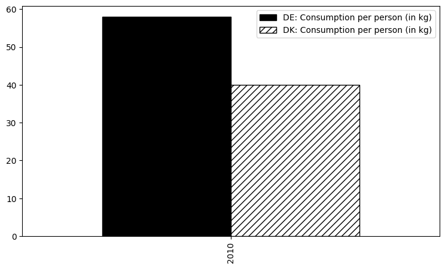

# Denmark vs Germany
## Which nation is more potato?

# Goal

This analysis aims to determine which nation consumes more potatoes now and has done so historically. As well as compare the amount of land used for growing potatoes for human consumption in comparison to the countries overall size.

The data sets are obtained from the statistical institutes of the respective countries.

* Denmark - [Danmarks Statistik](https://www.dst.dk/en/)
* Germany - [Statistisches Bundesamt](https://www.destatis.de/DE/Home/_inhalt.html)
* Germany - [Bundesinformationszentrum Landwirtschaft](https://www.ble.de/DE/BZL/Daten-Berichte/Kartoffeln/Kartoffeln_node.html;jsessionid=8681CD395D259B8E611E3A6D6203DCF7.internet011)

# Results

According to the consumption per person and the agricultural use of land for growing potatoes, Germany is the chunkier potato nation. 
With 57.9 kg per head per year Germans consumed 17.9 kg of potatoes more than Danes with their 40 kg in 2010. 

 
0,74 % of Germanys total area in 2022 was used for growing potatoes for human consumption, while only 0,16 % of Denmarks land was used for that purpose.

# Outlook

Further analysis could examin the export/import ratio, the different varities grown on fields or the percentage of a household's budget used for the starchy root vegetable. As well as look at the cultural significance with the amount of different potato dishes each country has on their menu.

# Note

[WIP] This is my first non-tutorial project. Everyone’s start in something new is messy, isn't it?
